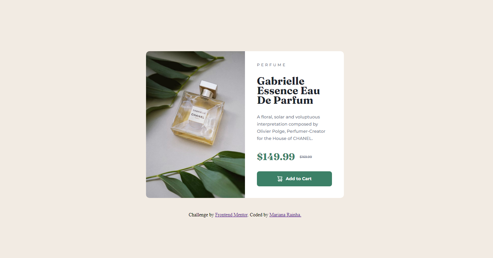

# Frontend Mentor - Product preview card component solution

This is a solution to the [Product preview card component challenge on Frontend Mentor](https://www.frontendmentor.io/challenges/product-preview-card-component-GO7UmttRfa).

## Table of contents

- [Overview](#overview)
  - [The challenge](#the-challenge)
  - [Screenshot](#screenshot)
  - [Links](#links)
- [My process](#my-process)
  - [Built with](#built-with)
   - [What I learned](#what-i-learned)
- [Author](#author)


## Overview

### The challenge

Users should be able to:

- View the optimal layout depending on their device's screen size
- See hover and focus states for interactive elements

### Screenshot



### Links

- [Git hub code](https://github.com/marianarainha/product-preview-card-component)
- [Git hub live page](https://marianarainha.github.io/product-preview-card-component/)

## My process

### Built with

- Semantic HTML5 markup
- CSS custom properties
- Flexbox
- CSS Grid
- Mobile-first workflow

### What I learned

Using the <picture> HTML element with two <source> elements and one  element to offer alternative versions of an image for different display/device scenarios. 

```html
      <picture>
          <source
            srcset="./images/image-product-mobile.jpg"
            media="(max-width: 500px)"
          />
          
        </picture>
```

Turning an element only visible to screen readers with CSS

```css
.sr-only {
  position: absolute;
  left: -10000px;
  width: 1px;
  height: 1px;
  top: auto;
  overflow: hidden;
}
```


## Author

- Website - [Github](https://github.com/marianarainha)
- Frontend Mentor - [@marianarainha](https://www.frontendmentor.io/profile/marianarainha)
- Twitter - [@yourusername](https://www.twitter.com/yourusername)
